# 스토리 분기 흐름도

> 17개 JSON 파일, 60+ 라벨의 전체 스토리 흐름과 분기 구조

---

## 1. 전체 분기 개요

```mermaid
graph TD
    Start --> Prologue
    Prologue -->|fade_jump| SchoolArrival
    SchoolArrival -->|fade_jump| Day1UnknownHint

    Day1UnknownHint -->|"소라에게 물어본다"| Day1UnknownHintSora
    Day1UnknownHint -->|"하나에게 물어본다"| Day1UnknownHintHana
    Day1UnknownHintSora -->|fade_jump| MorningEvent
    Day1UnknownHintHana -->|fade_jump| MorningEvent

    MorningEvent -->|"소라를 도와준다"| HelpSora
    MorningEvent -->|"하나를 따라간다"| GoWithHana
    HelpSora --> LunchTime
    GoWithHana --> LunchTime

    LunchTime -->|"helped_sora"| LunchTimeSoraWarm
    LunchTime -->|"else"| LunchTimeHanaWarm
    LunchTimeSoraWarm --> LunchTimeChoice
    LunchTimeHanaWarm --> LunchTimeChoice

    LunchTimeChoice -->|"소라와 함께"| Library
    LunchTimeChoice -->|"하나와 함께"| Rooftop
    Library --> Day1Afternoon
    Rooftop --> Day1Afternoon

    Day1Afternoon -->|"helped_sora"| Day1NightSora
    Day1Afternoon -->|"else"| Day1NightHana
    Day1NightSora -->|fade_jump| Day2Start
    Day1NightHana -->|fade_jump| Day2Start

    Day2Start -->|"helped_sora"| Day2SoraGreeting
    Day2Start -->|"else"| Day2HanaGreeting
    Day2SoraGreeting --> Day2ScienceLab
    Day2HanaGreeting --> Day2ScienceLab

    Day2ScienceLab -->|"소라에게"| Day2ScienceLabSora
    Day2ScienceLab -->|"하나에게"| Day2ScienceLabHana
    Day2ScienceLab -->|"조용히 넘어간다"| Day2ScienceLabSkip
    Day2ScienceLabSora --> Day2Morning
    Day2ScienceLabHana --> Day2Morning
    Day2ScienceLabSkip --> Day2Morning

    Day2Morning -->|"소라와 함께"| Day2WithSora
    Day2Morning -->|"하나와 함께"| Day2WithHana
    Day2WithSora --> Day2Evening
    Day2WithHana --> Day2Evening

    Day2Evening -->|"sora >= 4"| Day2SoraEvening
    Day2Evening -->|"hana >= 4"| Day2HanaEvening
    Day2Evening -->|"else"| Day2NeutralEvening
    Day2SoraEvening --> Day2End
    Day2HanaEvening --> Day2End
    Day2NeutralEvening --> Day2End
    Day2End --> Day3Start

    Day3Start -->|"unknown >= 1"| Day3PhotoDiscovery
    Day3Start -->|"else"| Day3MainBranch
    Day3PhotoDiscovery --> Day3MainBranch

    Day3MainBranch -->|"sora >= 4 AND hana >= 4"| Day3BothHigh
    Day3MainBranch -->|"sora > hana"| Day3SoraRoute
    Day3MainBranch -->|"hana > sora"| Day3HanaRoute
    Day3MainBranch -->|"else"| Day3Balanced

    Day3BothHigh -->|"소라와 전시회"| Day3SoraRoute
    Day3BothHigh -->|"하나와 전시회"| Day3HanaRoute
    Day3BothHigh -->|"셋이서 같이"| Day3TogetherRoute
    Day3Balanced --> Day3TogetherRoute

    Day3SoraRoute --> Day3SoraClimax
    Day3HanaRoute --> Day3HanaClimax
    Day3TogetherRoute --> Day3TogetherClimax
    Day3SoraClimax -->|fade_jump| Day4Start
    Day3HanaClimax -->|fade_jump| Day4Start
    Day3TogetherClimax -->|fade_jump| Day4Start

    Day4Start -->|"unknown >= 2"| Day4MeetUnknownHigh
    Day4Start -->|"else"| Day4MeetUnknownNormal
    Day4MeetUnknownHigh --> Day4Morning
    Day4MeetUnknownNormal --> Day4Morning

    Day4Morning -->|"소라에 대해"| Day4AskAboutSora
    Day4Morning -->|"하나에 대해"| Day4AskAboutHana
    Day4Morning -->|"셋이서"| Day4AskAboutAll
    Day4AskAboutSora --> Day4Lunch
    Day4AskAboutHana --> Day4Lunch
    Day4AskAboutAll --> Day4Lunch

    Day4Lunch -->|"sora_deepen"| Day4SoraAfternoon
    Day4Lunch -->|"hana_deepen"| Day4HanaAfternoon
    Day4Lunch -->|"else"| Day4TogetherAfternoon
    Day4SoraAfternoon --> Day4Evening
    Day4HanaAfternoon --> Day4Evening
    Day4TogetherAfternoon --> Day4Evening

    Day4Evening -->|"소라에게"| Day5SoraRoute
    Day4Evening -->|"하나에게"| Day5HanaRoute
    Day4Evening -->|"두 사람 모두"| Day5TogetherRoute

    Day5SoraRoute --> Day5SoraLibrary
    Day5SoraLibrary --> Day5SoraConfess2
    Day5SoraConfess2 -->|"기다릴게"| SoraTrueLoveEnd
    Day5SoraConfess2 -->|"무리하지 않아도"| SoraWarmEnd

    Day5HanaRoute --> Day5HanaPool
    Day5HanaPool --> Day5HanaConfess2
    Day5HanaConfess2 -->|"전부 좋아해"| HanaTrueLoveEnd
    Day5HanaConfess2 -->|"천천히 가자"| HanaWarmEnd

    Day5TogetherRoute --> Day5TogetherLetter

    style SoraTrueLoveEnd fill:#4a90d9,color:#fff
    style SoraWarmEnd fill:#87CEEB,color:#000
    style HanaTrueLoveEnd fill:#e87ba1,color:#fff
    style HanaWarmEnd fill:#FFB6C1,color:#000
    style Day5TogetherLetter fill:#9370db,color:#fff
```



---

## 2. 일자별 상세 분석

### Day 1 - 첫 만남 (6개 라벨, 3개 선택지)

| 라벨 | 분기 유형 | 상세 |
|------|----------|------|
| `Start` | 자동 | 이름 입력 → Prologue로 점프 |
| `Prologue` | 자동 | 오프닝 CG 해금 → SchoolArrival로 페이드 점프 |
| `SchoolArrival` | 자동 | 교실 도착 → Day1UnknownHint로 페이드 점프 |
| **`Day1UnknownHint`** | **선택지** | "소라에게 물어본다" / "하나에게 물어본다" |
| **`MorningEvent`** | **선택지** | "소라를 도와준다" (`helped_sora=true`, `sora+2`) / "하나를 따라간다" (`hana+2`) |
| `LunchTime` | 조건 | `helped_sora` 여부로 대화 분기 |
| **`LunchTimeChoice`** | **선택지** | "소라와 함께" (`sora+1`, `chose_library=true`) / "하나와 함께" (`hana+1`) |
| `Day1Afternoon` | 조건 | `helped_sora` 여부로 밤 분기 |

**Day 1 호감도 최대 획득**: 소라 +3 또는 하나 +3

### Day 2 - 관계 심화 (14개 라벨, 2개 선택지)

| 라벨 | 분기 유형 | 상세 |
|------|----------|------|
| `Day2Start` | 조건 | `helped_sora` → 소라/하나 인사 분기 |
| `Day2SoraGreeting` | 조건 | `sora_affection >= 3` → High/Normal 분기 |
| `Day2HanaGreeting` | 조건 | `hana_affection >= 3` → High/Normal 분기 |
| **`Day2ScienceLab`** | **선택지** | 3지 선택 (소라/하나/조용히). 소라/하나 선택 시 `unknown_interest+1` |
| **`Day2Morning`** | **선택지** | "소라와 함께" (`sora+2`) / "하나와 함께" (`hana+2`) |
| `Day2Evening` | 조건 | `sora >= 4` → 소라 저녁, `hana >= 4` → 하나 저녁, else → 중립 저녁 |
| `Day2End` | 자동 | `unknown_interest+1`, 버스정류장 CG |

**Day 2 호감도 최대 획득**: 소라 +2 또는 하나 +2, unknown_interest +1~2

### Day 3 - 주요 분기점 (7개 라벨, 1개 선택지)

| 라벨 | 분기 유형 | 상세 |
|------|----------|------|
| `Day3Start` | 조건 | `unknown_interest >= 1` → 사진 발견 이벤트 |
| `Day3PhotoDiscovery` | 자동 | `unknown_interest+1`, photo-discovery CG |
| **`Day3MainBranch`** | **조건 (핵심)** | 4중 분기: 양쪽 높음/소라 우세/하나 우세/균형 |
| **`Day3BothHigh`** | **선택지** | 소라/하나/셋이서 3지 선택 (양쪽 모두 높을 때만) |
| `Day3Balanced` | 자동 | 균형 시 → 함께 루트 |

**루트 확정**: `day3_ending_type` 설정 (`sora_deepen` / `hana_deepen` / `together_deepen`)

### Day 4 - 유우와의 만남 (9개 라벨, 1개 선택지)

| 라벨 | 분기 유형 | 상세 |
|------|----------|------|
| `Day4Start` | 조건 | `unknown_interest >= 2` → 유우 첫 만남 CG |
| **`Day4Morning`** | **선택지** | 유우에게 소라/하나/셋이서 질문 |
| `Day4Lunch` | 조건 | `day3_ending_type`으로 오후 분기 |
| **`Day4Evening`** | **선택지** | 최종 루트 선택: 소라/하나/둘 다 |

### Day 5 - 결말 (11개 라벨, 2개 선택지)

| 라벨 | 엔딩 | 선택지 |
|------|------|--------|
| **`Day5SoraConfess2`** | 소라 엔딩 | "기다릴게" (트루러브, `sora+3`) / "무리하지 않아도" (워밍, `sora+2`) |
| **`Day5HanaConfess2`** | 하나 엔딩 | "전부 좋아해" (트루러브, `hana+3`) / "천천히 가자" (워밍, `hana+2`) |
| `Day5TogetherLetter` | 함께 엔딩 | 선택 없음 (자동) |

---

## 3. 호감도 임계값 맵

게임 진행 중 조건 분기에 사용되는 모든 임계값:

| 조건식 | 사용 위치 | 효과 |
|--------|----------|------|
| `helped_sora == true` | Day1 `LunchTime`, `Day1Afternoon`, Day2 `Day2Start` | 소라/하나 대화 텍스트 분기 |
| `sora_affection >= 3` | `Day2SoraGreeting` | 소라 인사 High/Normal |
| `hana_affection >= 3` | `Day2HanaGreeting` | 하나 인사 High/Normal |
| `sora_affection >= 4` | `Day2Evening` | 소라 저녁 이벤트 발생 |
| `hana_affection >= 4` | `Day2Evening` | 하나 저녁 이벤트 발생 |
| `sora_affection >= 4 AND hana_affection >= 4` | `Day3MainBranch` | 양쪽 높음 → 3지 선택 가능 |
| `sora_affection > hana_affection` | `Day3MainBranch` | 소라 루트 자동 진입 |
| `hana_affection > sora_affection` | `Day3MainBranch` | 하나 루트 자동 진입 |
| `unknown_interest >= 1` | `Day3Start` | 사진 발견 이벤트 |
| `unknown_interest >= 2` | `Day4Start` | 유우 첫 만남 + CG 해금 |
| `day3_ending_type == sora_deepen` | `Day4Lunch` | Day4 소라 오후 |
| `day3_ending_type == hana_deepen` | `Day4Lunch` | Day4 하나 오후 |

---

## 4. 변수 설정/참조 의존 그래프

### 4.1 변수별 설정 지점

| 변수 | 설정 위치 (라벨) | 값 / 연산 |
|------|-----------------|-----------|
| `player.name` | `Start` | 플레이어 입력값 (input 명령) |
| `sora_affection` | `HelpSora` (+2), `Library` (+1), `Day2WithSora` (+2), `Day3SoraRoute` (+1), `Day4AskAboutSora` (+1), `Day4AskAboutAll` (+1), `SoraTrueLoveEnd` (+3), `SoraWarmEnd` (+2) | 최대 합계: 10+ |
| `hana_affection` | `GoWithHana` (+2), `Rooftop` (+1), `Day2WithHana` (+2), `Day3HanaRoute` (+1), `Day4AskAboutHana` (+1), `Day4AskAboutAll` (+1), `HanaTrueLoveEnd` (+3), `HanaWarmEnd` (+2) | 최대 합계: 10+ |
| `helped_sora` | `HelpSora` (true), `GoWithHana` (false) | bool |
| `chose_library` | `Library` (true), `Rooftop` (false) | bool |
| `day2_studied_together` | `Day2WithSora` (true) | bool |
| `unknown_interest` | `Day2ScienceLabSora` (+1), `Day2ScienceLabHana` (+1), `Day2End` (+1), `Day3PhotoDiscovery` (+1) | 최대 합계: 3 |
| `met_unknown` | `Day4MeetUnknownHigh` (true), `Day4MeetUnknownNormal` (true) | bool |
| `chose_both` | `Day3TogetherRoute` (true) | bool |
| `day3_ending_type` | `Day3SoraClimax` ("sora_deepen"), `Day3HanaClimax` ("hana_deepen"), `Day3TogetherClimax` ("together_deepen") | String |

### 4.2 변수별 참조 지점

| 변수 | 참조 위치 (라벨) | 조건 |
|------|-----------------|------|
| `helped_sora` | `LunchTime`, `Day1Afternoon`, `Day2Start` | `== true` |
| `sora_affection` | `Day2SoraGreeting` (`>= 3`), `Day2Evening` (`>= 4`), `Day3MainBranch` (`>= 4`, `> hana`) | 비교 |
| `hana_affection` | `Day2HanaGreeting` (`>= 3`), `Day2Evening` (`>= 4`), `Day3MainBranch` (`>= 4`, `> sora`) | 비교 |
| `unknown_interest` | `Day3Start` (`>= 1`), `Day4Start` (`>= 2`) | 비교 |
| `day3_ending_type` | `Day4Lunch` (`== sora_deepen`, `== hana_deepen`) | 문자열 비교 |

---

## 5. 엔딩 도달 경로

### 엔딩 A: 소라 트루 러브 (`SoraTrueLoveEnd`)

```
Day1: 소라를 도와준다(sora+2) → 소라와 함께(sora+1)
Day2: 소라에게 물어본다(unknown+1) → 소라와 함께(sora+2)
Day3: sora > hana → Day3SoraRoute(sora+1) → day3_ending_type = "sora_deepen"
Day4: 소라에 대해 물어봄(sora+1) → 소라에게 다시 한번
Day5: "기다릴게"(sora+3)
총 소라 호감도: 2+1+2+1+1+3 = 10
```

### 엔딩 B: 소라 워밍 (`SoraWarmEnd`)

위와 동일하되 Day5에서 "무리하지 않아도" 선택 (`sora+2`, 총 9)

### 엔딩 C: 하나 트루 러브 (`HanaTrueLoveEnd`)

```
Day1: 하나를 따라간다(hana+2) → 하나와 함께(hana+1)
Day2: 하나에게 물어본다(unknown+1) → 하나와 함께(hana+2)
Day3: hana > sora → Day3HanaRoute(hana+1) → day3_ending_type = "hana_deepen"
Day4: 하나에 대해 물어봄(hana+1) → 하나에게 다시 한번
Day5: "전부 좋아해"(hana+3)
총 하나 호감도: 2+1+2+1+1+3 = 10
```

### 엔딩 D: 하나 워밍 (`HanaWarmEnd`)

위와 동일하되 Day5에서 "천천히 가자" 선택 (`hana+2`, 총 9)

### 엔딩 E: 함께 (`Day5TogetherLetter`)

```
Day1: 소라+2, 하나+1 (또는 반대) → 밸런스 유지
Day2: 양쪽 고르게 선택
Day3: sora >= 4 AND hana >= 4 → Day3BothHigh → "셋이서 같이" → chose_both = true
      또는 균형 → Day3Balanced → 자동 함께 루트
Day4: "셋이서 어떤 사이였어요?" (sora+1, hana+1) → "두 사람 모두 소중해"
Day5: Day5TogetherLetter (자동)
```

---

## 6. CG 갤러리 해금 맵

| CG ID | 해금 라벨 | Day | 루트 조건 |
|-------|----------|-----|----------|
| `opening-unknown` | `Prologue` | 1 | 공통 (필수) |
| `silhouette` | `Day1Afternoon` | 1 | 공통 |
| `library-sora` | `Library` | 1 | 소라 점심 선택 |
| `rooftop-hana` | `Rooftop` | 1 | 하나 점심 선택 |
| `crane-gift` | `Day2WithSora` | 2 | 소라 함께 |
| `sora-sunset-smile` | `Day2SoraEvening` | 2 | sora >= 4 |
| `hana-sunset-promise` | `Day2HanaEvening` | 2 | hana >= 4 |
| `three-walk-home` | `Day2NeutralEvening` | 2 | 양쪽 < 4 |
| `busstop-silhouette` | `Day2End` | 2 | 공통 |
| `photo-discovery` | `Day3PhotoDiscovery` | 3 | unknown >= 1 |
| `sora-exhibition` | `Day3SoraRoute` | 3 | 소라 루트 |
| `pool-secret` | `Day4Lunch` | 4 | 공통 |
| `yuu-first-meet` | `Day4MeetUnknownHigh` | 4 | unknown >= 2 |
| `hana-unmasked` | `Day4HanaAfternoon` | 4 | 하나 루트 |
| `sora-past-tears` | `Day4SoraAfternoon` | 4 | 소라 루트 |
| `hana-confession` | `Day5HanaPool` | 5 | 하나 루트 |
| `sora-confession` | `Day5SoraLibrary` | 5 | 소라 루트 |
| `hana-truelove` | `HanaTrueLoveEnd` | 5 | 하나 트루러브 선택 |
| `hana-warm` | `HanaWarmEnd` | 5 | 하나 워밍 선택 |
| `sora-truelove` | `SoraTrueLoveEnd` | 5 | 소라 트루러브 선택 |
| `sora-warm` | `SoraWarmEnd` | 5 | 소라 워밍 선택 |
| `together-letter` | `Day5TogetherLetter` | 5 | 함께 루트 |

**1회차 최대 해금 수**: 약 12~14개 (루트에 따라 다름)
**전체 CG 수**: 22개 (scene_map 기준, 갤러리 등록 기준)

---

## 7. BGM 사용 맵

| BGM ID | 재생 라벨 | 시점 |
|--------|----------|------|
| `sunny-day` | `Start` | 게임 시작 ~ Day3 |
| `sora-ending` | `Day3SoraClimax` | 소라 루트 확정 시 |
| `hana-ending` | `Day3HanaClimax` | 하나 루트 확정 시 |
| `harem-ending` | `Day3TogetherClimax` | 함께 루트 확정 시 |
| `acoustic-chill` | `Day4Start` | Day4 시작 |
| `sora-ending` | `Day5SoraLibrary` | 소라 고백 |
| `hana-ending` | `Day5HanaPool` | 하나 고백 |
| `harem-ending` | `Day5TogetherLetter` | 함께 엔딩 |

---

## 8. 라벨 파일 매핑

| 파일 | 포함 라벨 |
|------|----------|
| `day1/day1-common.json` | Start, Prologue, SchoolArrival, Day1UnknownHint, Day1UnknownHintSora, Day1UnknownHintHana, MorningEvent, LunchTime, LunchTimeSoraWarm, LunchTimeHanaWarm, LunchTimeChoice, Day1Afternoon, Day1NightSora, Day1NightHana |
| `day1/day1-sora.json` | HelpSora, Library |
| `day1/day1-hana.json` | GoWithHana, Rooftop |
| `day2/day2-common.json` | Day2Start, Day2SoraGreeting, Day2SoraGreetingHigh, Day2SoraGreetingNormal, Day2HanaGreeting, Day2HanaGreetingHigh, Day2HanaGreetingNormal, Day2ScienceLab, Day2ScienceLabSora, Day2ScienceLabHana, Day2ScienceLabSkip, Day2Morning, Day2Evening, Day2NeutralEvening, Day2End |
| `day2/day2-sora.json` | Day2WithSora, Day2SoraEvening |
| `day2/day2-hana.json` | Day2WithHana, Day2HanaEvening |
| `day3/day3-common.json` | Day3Start, Day3PhotoDiscovery, Day3MainBranch, Day3BothHigh, Day3Balanced |
| `day3/day3-sora.json` | Day3SoraRoute, Day3SoraClimax |
| `day3/day3-hana.json` | Day3HanaRoute, Day3HanaClimax |
| `day3/day3-together.json` | Day3TogetherRoute, Day3TogetherClimax |
| `day4/day4-common.json` | Day4Start, Day4MeetUnknownHigh, Day4MeetUnknownNormal, Day4Morning, Day4AskAboutSora, Day4AskAboutHana, Day4AskAboutAll, Day4Lunch, Day4Evening |
| `day4/day4-sora.json` | Day4SoraAfternoon |
| `day4/day4-hana.json` | Day4HanaAfternoon |
| `day4/day4-together.json` | Day4TogetherAfternoon |
| `day5/day5-sora.json` | Day5SoraRoute, Day5SoraLibrary, Day5SoraConfess2, SoraTrueLoveEnd, SoraWarmEnd |
| `day5/day5-hana.json` | Day5HanaRoute, Day5HanaPool, Day5HanaConfess2, HanaTrueLoveEnd, HanaWarmEnd |
| `day5/day5-together.json` | Day5TogetherRoute, Day5TogetherLetter |
